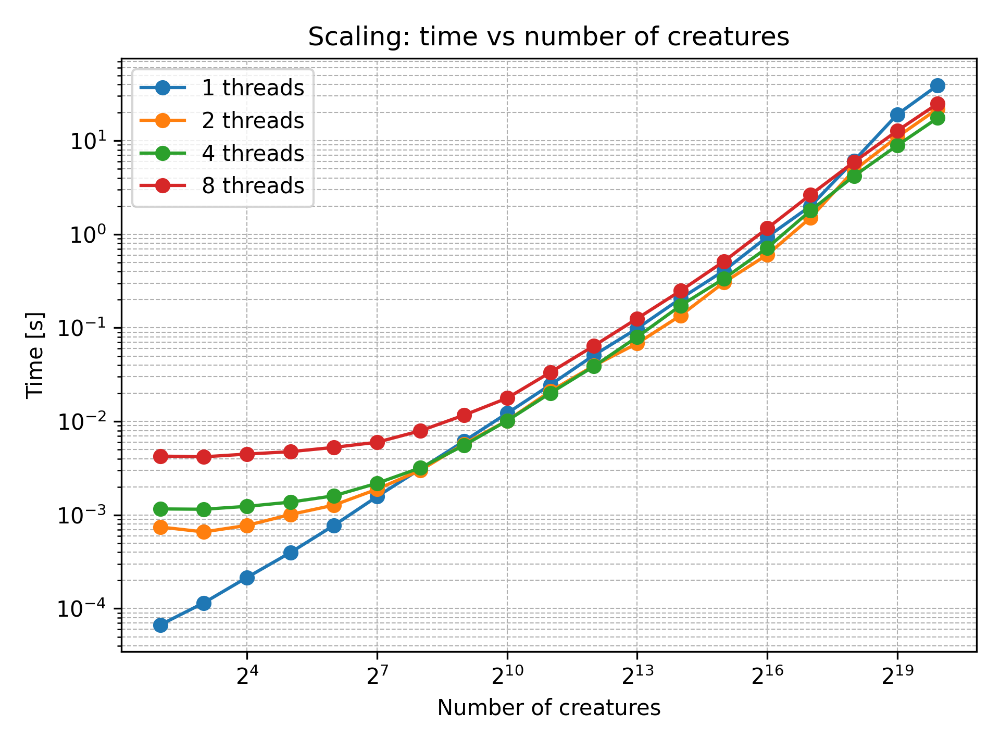
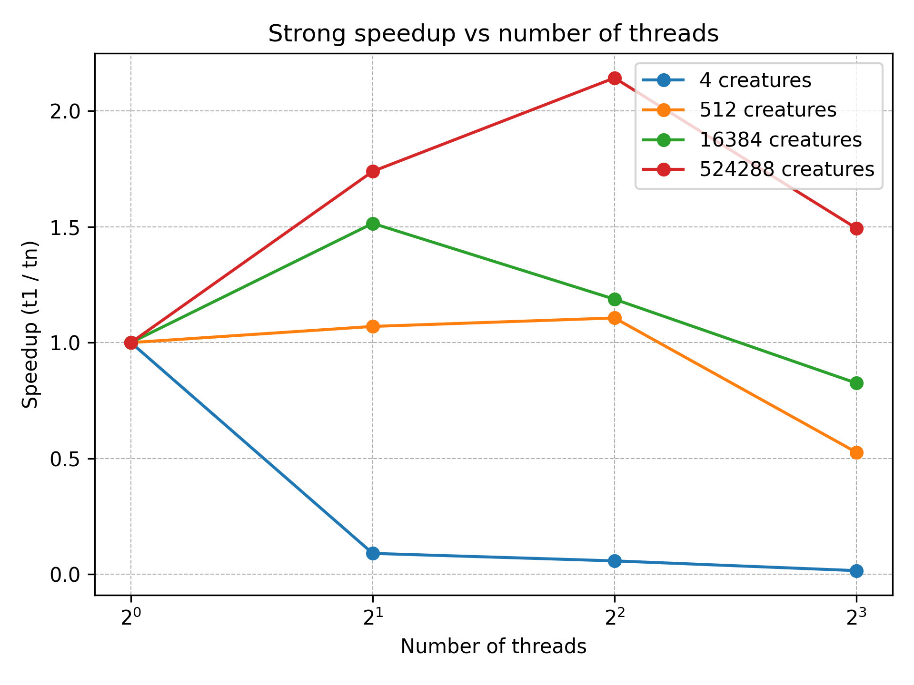

#  Differential Evolution Heuristic
Differential Evolution (DE) is a population-based optimization algorithm designed for solving nonlinear and non-differentiable continuous functions. Inspired by evolutionary strategies, DE maintains a population of candidate solutions that evolves over generations using biologically inspired operations: mutation, crossover, and selection.

At each iteration, for every candidate vector xixi​, the algorithm creates a mutant vector by adding the weighted difference of two other randomly selected population vectors to a third one. This mutant is then combined with the original candidate through crossover to form a trial vector. Finally, selection chooses between the trial and the original candidate based on which has the better fitness (i.e., lower objective value). This process iteratively refines the population, driving it toward the global minimum.

DE is valued for its simplicity, parallelizability, and strong performance on a wide range of black-box optimization problems, especially in high-dimensional or rugged search landscapes.
## Multithreading version (OMP)
### Main
> ⚙️ **Executable Overview** – This section explains how to run the main OpenMP Differential Evolution implementation.


#### Execution
An example invocation of the `main` executable for the OpenMP Differential Evolution implementation (all the detailed flag for main execution are in the main readme page):

```bash
./build/main -a differential_omp -d 2 -n 100 -i 100 -f sphere
```

#### Sample output
```console
Iteration n. 1 / 100
  Current minimum:
  f(-7.798279e-01, 2.117076e+00) = 5.090143e+00

Iteration n. 2 / 100
  Current minimum:
  f(-7.798279e-01, 2.117076e+00) = 5.090143e+00

…

Iteration n. 99 / 100
  Current minimum:
  f(1.976930e-13, 1.210598e-13) = 5.373799e-26

Iteration n. 100 / 100
  Current minimum:
  f(1.976930e-13, 1.210598e-13) = 5.373799e-26

Minimum found:
  f(1.976930e-13, 1.210598e-13) = 5.373799e-26
Total execution time: 0.020753 seconds
```
#### Comments

- **Progress reporting**: Each iteration prints the current best solution (coordinates and objective value).  
- **Convergence behavior**: The objective value decreases rapidly, reaching ~5×10⁻²⁶ by iteration 100.  
- **Performance**: 100 iterations on a 2-D Sphere function with 100 candidates and 5 threads complete in ~0.02 s.

### Test
> ✅ **Test Suite Summary** – Automated tests  to validate correctness and convergence.


A comprehensive test suite is provided to verify the correctness and convergence properties of the Differential Evolution implementation. All tests are written in C++17 using the GoogleTest framework and exercise the algorithm on four classic benchmark functions.

#### Function tested 
| Test Name                         | Objective Function | Convergence Criterion                |
| --------------------------------- | ------------------ | ------------------------------------ |
| `DeConvergence.Sphere`            | Sphere             | ‖f(x) – 0‖ ≤ 1 × 10⁻³                |
| `DeConvergence.EuclideanDistance` | Euclidean Distance | ‖f(x) – 0‖ ≤ 1 × 10⁻³                |
| `DeConvergence.Rosenbrock`        | Rosenbrock         | Position error ≤ 0.1 (narrow valley) |
| `DeConvergence.Rastrigin`         | Rastrigin          | ‖f(x) – 0‖ ≤ 1 × 10⁻³                |


#### Test Setup

- **Framework:** GoogleTest  
- **Dimensions:** 2  
- **Population size:** 100 candidates  
- **Max iterations:** 1 000  
- **Random seed:** 42  
- **Search bounds:** \[-10, 10\]  
- **Differential weight (F):** 0.5  
- **Crossover rate (CR):** 0.8  
- **Threads:** 5  

Each test invokes:
```cpp
auto result = algorithm::run_differential_evolution(
    dimensions,
    num_candidates,
    lower_bound,
    upper_bound,
    seed,
    max_iterations,
    F,
    CR,
    objectiveFunction,
    /* num_threads= */ 5,
    /* verbose= */ false
);
```
#### Test result 
All four tests passed:

```console
[==========] Running 4 tests from 1 test suite.
[----------] Global test environment set-up.
[ RUN      ] DeConvergence.Sphere
[       OK ] DeConvergence.Sphere (81 ms)
[ RUN      ] DeConvergence.EuclideanDistance
[       OK ] DeConvergence.EuclideanDistance (67 ms)
[ RUN      ] DeConvergence.Rosenbrock
[       OK ] DeConvergence.Rosenbrock (65 ms)
[ RUN      ] DeConvergence.Rastrigin
[       OK ] DeConvergence.Rastrigin (66 ms)
[----------] 4 tests from DeConvergence (280 ms total)
[  PASSED  ] 4 tests.
```


#### Summary of test duration
| Test                   | Duration |
| ---------------------- | -------: |
| Sphere                 |    81 ms |
| EuclideanDistance      |    67 ms |
| Rosenbrock             |    65 ms |
| Rastrigin              |    66 ms |
| **Total elapsed time** |   280 ms |


### Benchmark
> 📊 **Performance Benchmarking** – Evaluate speedup and scaling on different workloads and thread counts.

The algorithm was tested with varying numbers of threads and different population sizes (called "creatures").

####  Time vs Number of Creatures



This chart shows how much faster the algorithm runs when we use more threads, keeping the total number of creatures the same.

- **4 creatures**: Too few tasks. More threads just add overhead, so it gets slower.  
- **512 creatures**: A small boost up to 2–4 threads, but after that extra threads don’t help.  
- **16 384 creatures**: About 1.5× faster with 4 threads. Adding more threads gives smaller and smaller returns.  
- **524 288 creatures**: Best case—around 2× speedup with 4 threads. Beyond 4 threads, overhead and memory contention start to slow things down.

> **Key point:** You need enough work per thread to see a real gain. Very small problems don’t speed up; medium-to-large ones do, up to about 4–8 threads.


####  Strong Speedup vs Number of Threads

In this plot we measure **strong scaling** by fixing the total population size and varying the number of threads. 
**Speedup**  
**S(t)** = `t_1 / t_n`  
where `t_1` is the time with one thread and `t_n` with _n_ threads.



This plot shows how long the algorithm takes for different population sizes, using 1, 2, 4, or 8 threads.

- **Small populations** (up to ~64 creatures): 1 thread is fastest because creating threads adds extra work.  
- **Medium populations**: 2 and 4 threads start to outperform 1 thread, showing clear speedup.  
- **Large populations** (above ~65 000 creatures): All curves run in a straight line on the log–log plot, meaning time grows roughly in proportion to the number of creatures.  
- **8 threads** is a bit slower than 4 threads in the middle range, but for very large sizes it follows the same trend.

> **Bottom line:** Runtime scales linearly with problem size, and multithreading helps once the population is big enough.```


## Multiprocessing version (MPI)

> **Note:**
> Follow the instructions in the main readme page to compile properly to use MPI.
> This MPI-based implementation is provided for educational purposes. In practice, MPI shines on distributed systems or clusters, whereas on a single multi-core machine it can incur additional communication overhead. As a result, we do not include a full benchmark suite here (and the Google Benchmark integration currently causes conflicts). What remains is:
> 1. an MPI-enabled `main` that runs Differential Evolution across multiple processes, and  
> 2. the same convergence tests you’ve already seen (using GoogleTest).

The algorithm is partitioned so that each MPI rank evolves its own subset of the population. At each generation:
1. every rank runs one DE update on its local candidates,  
2. each rank computes its best local solution,  
3. an `MPI_Allreduce` (with `MPI_MINLOC`) finds the global-best fitness and the rank that holds it,  
4. that rank broadcasts its best candidate vector to all others,  
5. the next generation proceeds using that shared global best.  

This design minimizes inter-process communication (only one `Allreduce` and one `Bcast` per iteration), at the cost of never mixing candidates between ranks.

### Main  
You can run it like so (full detail flag usage in main readme page):
```bash
mpirun -n 4 ./build/main -a differential_mpi -d 2 -n 100 -i 100 -f sphere -j 1
```
Sample output (only a few iterations shown):
```console
Iteration n. 1 / 100
  Current minimum:
  f(-8.384779e+00, 2.789538e+00) = 7.808604e+01

Iteration n. 2 / 100
  Current minimum:
  f(-7.100683e+00, 5.125734e+00) = 7.669284e+01

…

Iteration n. 98 / 100
  Current minimum:
  f(-1.217977e-12, -9.401532e-13) = 2.367357e-24

Iteration n. 99 / 100
  Current minimum:
  f(-1.217977e-12, -9.401532e-13) = 2.367357e-24

Iteration n. 100 / 100
  Current minimum:
  f(2.020037e-13, -1.754170e-13) = 7.157664e-26

Minimum found:
  f(2.020037e-13, -1.754170e-13) = 7.157664e-26  
Total execution time: 0.001724 seconds
```
### Test
You can run the tests like so:
```bash
mpirun -n 4 test_de_convergence_mpi
```

All the test are passed even in the multiprocessing version of the algorithm:
```console
[==========] Running 4 tests from 1 test suite.
[----------] Global test environment set-up.
[----------] 4 tests from DeConvergenceMPI
[ RUN      ] DeConvergenceMPI.Sphere
[==========] Running 4 tests from 1 test suite.
[----------] Global test environment set-up.
[----------] 4 tests from DeConvergenceMPI
[ RUN      ] DeConvergenceMPI.Sphere
[==========] Running 4 tests from 1 test suite.
[----------] Global test environment set-up.
[----------] 4 tests from DeConvergenceMPI
[ RUN      ] DeConvergenceMPI.Sphere
[==========] Running 4 tests from 1 test suite.
[----------] Global test environment set-up.
[----------] 4 tests from DeConvergenceMPI
[ RUN      ] DeConvergenceMPI.Sphere
[       OK ] DeConvergenceMPI.Sphere (8 ms)
[ RUN      ] DeConvergenceMPI.EuclideanDistance
[       OK ] DeConvergenceMPI.Sphere (8 ms)
[ RUN      ] DeConvergenceMPI.EuclideanDistance
[       OK ] DeConvergenceMPI.Sphere (8 ms)
[ RUN      ] DeConvergenceMPI.EuclideanDistance
[       OK ] DeConvergenceMPI.Sphere (8 ms)
[ RUN      ] DeConvergenceMPI.EuclideanDistance
[       OK ] DeConvergenceMPI.EuclideanDistance (9 ms)
[ RUN      ] DeConvergenceMPI.Rosenbrock
[       OK ] DeConvergenceMPI.EuclideanDistance (9 ms)
[ RUN      ] DeConvergenceMPI.Rosenbrock
[       OK ] DeConvergenceMPI.EuclideanDistance (9 ms)
[ RUN      ] DeConvergenceMPI.Rosenbrock
[       OK ] DeConvergenceMPI.EuclideanDistance (9 ms)
[ RUN      ] DeConvergenceMPI.Rosenbrock
[       OK ] DeConvergenceMPI.Rosenbrock (5 ms)
[ RUN      ] DeConvergenceMPI.Rastrigin
[       OK ] DeConvergenceMPI.Rosenbrock (5 ms)
[ RUN      ] DeConvergenceMPI.Rastrigin
[       OK ] DeConvergenceMPI.Rosenbrock (5 ms)
[ RUN      ] DeConvergenceMPI.Rastrigin
[       OK ] DeConvergenceMPI.Rosenbrock (5 ms)
[ RUN      ] DeConvergenceMPI.Rastrigin
[       OK ] DeConvergenceMPI.Rastrigin (5 ms)
[----------] 4 tests from DeConvergenceMPI (28 ms total)

[----------] Global test environment tear-down
[==========] 4 tests from 1 test suite ran. (28 ms total)
[  PASSED  ] 4 tests.
[       OK ] DeConvergenceMPI.Rastrigin (5 ms)
[----------] 4 tests from DeConvergenceMPI (28 ms total)

[----------] Global test environment tear-down
[==========] 4 tests from 1 test suite ran. (28 ms total)
[  PASSED  ] 4 tests.
[       OK ] DeConvergenceMPI.Rastrigin (5 ms)
[----------] 4 tests from DeConvergenceMPI (28 ms total)

[----------] Global test environment tear-down
[==========] 4 tests from 1 test suite ran. (28 ms total)
[  PASSED  ] 4 tests.
[       OK ] DeConvergenceMPI.Rastrigin (5 ms)
[----------] 4 tests from DeConvergenceMPI (28 ms total)

[----------] Global test environment tear-down
[==========] 4 tests from 1 test suite ran. (28 ms total)
[  PASSED  ] 4 tests.

```

