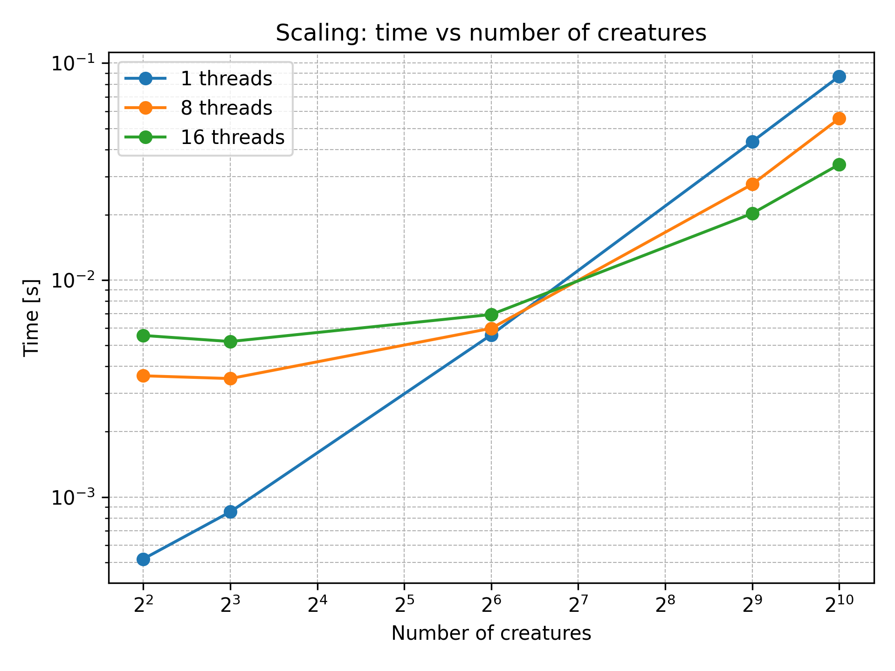

# 🧪  Differential Evolution Heuristic

The algorithm was tested with varying numbers of threads and different population sizes (called "creatures").

## 📊 Time vs Number of Creatures

This plot shows how the execution time (in seconds, log scale) varies as the number of creatures increases, for 1, 8, and 16 threads:

- With **1 thread**, the time grows consistently with the number of creatures.
- With **8 and 16 threads**, the performance improves significantly when the number of creatures is sufficiently large.
- For **small numbers of creatures**, multithreading introduces overhead that can outweigh the benefits of parallelization.
- The curves flatten in the low-creature region for 8 and 16 threads, showing that overhead dominates until the workload becomes heavy enough.

## ⚡ Strong Speedup vs Number of Threads

This plot shows **strong scaling**, i.e., how speedup changes as the number of threads increases, for a fixed number of creatures (4, 512, and 1024):

- **4 creatures:** Speedup decreases with more threads due to overhead dominating such a small workload.
- **512 creatures:** Modest speedup is observed, showing that parallelism becomes more effective.
- **1024 creatures:** Best performance scaling, achieving a speedup > 2.5× with 16 threads.

## 📌 Conclusions

- Parallel execution is effective only when the number of creatures is large enough to amortize thread management overhead.
- For small problem sizes, single-threaded execution remains more efficient.
- The algorithm demonstrates **scalability potential**, especially on larger workloads.

