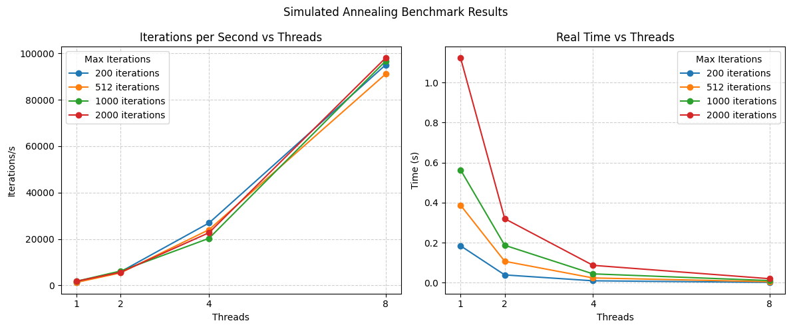

# Simulated Annealing 

Simulated Annealing (SA) is a stochastic optimization technique inspired by the physical annealing process in solids. It is especially effective for black-box optimization problems where the objective function is costly to evaluate, non-differentiable, or unknown in closed form.

The algorithm simulates how a material cools and gradually settles into a low-energy state. In this analogy:

- The **state space** corresponds to all possible solutions.
- The **objective function** represents the system’s energy, which the algorithm seeks to minimize.
- The **temperature** parameter controls the probability of accepting worse solutions to avoid getting trapped in local minima.

At each iteration, a new candidate solution is generated. If it improves the objective function, it is accepted unconditionally. Otherwise, it is accepted with probability:

$$ \
P(\text{accept}) = \exp\left(-\frac{\Delta f}{k \cdot T}\right)
\ $$

where:

- $$\(\Delta f\)$$ is the increase in the objective function value,
- $$\(k\)$$ is a constant analogous to Boltzmann’s constant,
- $$\(T\)$$ is the current temperature.

This acceptance rule, known as the *Metropolis criterion*, allows the algorithm to balance exploration and exploitation, gradually focusing the search as the temperature decreases.


## Multithreading version (OMP) 
### Main
> ⚙️ **Executable Overview** – This section explains how to run the main OpenMP Simulated Annealing implementation.


#### Execution
An example invocation of the `main` executable for the OpenMP Simulated Annealing implementation (all the detailed flag for main execution are in the main readme page):

```bash
./build/main -a simulated_omp -d 2 -i 100 -f sphere
```

## 🔍 Convergence Tests

This section documents a set of tests used to verify the **convergence behavior of the Simulated Annealing algorithm** on various classical objective functions. The tests are implemented using GoogleTest and check both the **accuracy of the solution** and the **closeness of the estimated minimum position** to the known global optimum.

Each test asserts that the algorithm achieves a result **sufficiently close to the known global minimum**, with different error thresholds tailored to the specific characteristics of each objective function.

### ⚠️ Parameter Sensitivity

The **algorithm parameters** (such as initial temperature, cooling rate, step size, etc.) are **not one-size-fits-all**—they are **tuned per function**, because each objective function presents unique challenges, such as:

- **Local curvature**: For instance, the Rastrigin function has many sharp local minima, while the Sphere function is smooth and convex.
- **Problem conditioning**: The Rosenbrock function has a narrow, curved valley that is hard to explore without fine-grained control.
- **Search domain scale** and **number of local minima**: Parameters like `step_size` and `temperature_scale` greatly affect the algorithm's ability to escape local optima and efficiently explore the space.

Choosing good parameters requires balancing exploration (via temperature and step size) with convergence (via cooling and step decay), and often involves empirical tuning.

---

#### ✅ Functions Tested

| Test Name                      | Objective Function    | Convergence Criterion                          |
|-------------------------------|------------------------|------------------------------------------------|
| `SaConvergence.Sphere`        | Sphere                 | ‖f(x) – 0‖ ≤ 1 × 10⁻³ <br>‖x – 0‖ ≤ 5 × 10⁻²     |
| `SaConvergence.EuclideanDistance` | Euclidean Distance  | ‖f(x) – 0‖ ≤ 3 × 10⁻³ <br>‖x – 0‖ ≤ 3 × 10⁻³     |
| `SaConvergence.Rosenbrock`    | Rosenbrock             | ‖f(x) – 0‖ ≤ 1 × 10⁻³ <br>‖x – x*‖ ≤ 1 × 10⁻²   |
| `SaConvergence.Rastrigin`     | Rastrigin              | ‖f(x) – 0‖ ≤ 1 × 10⁻² <br>‖x – 0‖ ≤ 2 × 10⁻²     |


---

### 🛠️ Test Setup

Each test shares the same general structure but uses function-specific parameters. All tests invoke the core routine:

```cpp
algorithm::run_simulated_annealing(
    dimensions,
    max_iterations,
    dwell,
    initial_temperature,
    temperature_scale,
    initial_step_size,
    step_size_scale,
    boltzmann_k,
    initial_guess,
    lower_bound,
    upper_bound,
    objective_function,
    seed,
    n_threads, // 4
    true  // verbose
);

#### Test result
```console
[==========] Running 4 tests from 1 test suite.
[----------] Global test environment set-up.
[----------] 4 tests from SaConvergence
[ RUN      ] SaConvergence.Sphere

Minimum found:
  f(3.490406e-04, -9.462030e-04) = 1.017129e-06
  Total execution time: 0.057894 seconds

[       OK ] SaConvergence.Sphere (58 ms)
[ RUN      ] SaConvergence.EuclideanDistance

Minimum found:
  f(5.057432e-06, -1.274359e-04) = 1.275363e-04
  Total execution time: 0.115275 seconds

[       OK ] SaConvergence.EuclideanDistance (115 ms)
[ RUN      ] SaConvergence.Rosenbrock

Minimum found:
  f(9.994925e-01, 9.991756e-01) = 6.201195e-07
  Total execution time: 0.091805 seconds

[       OK ] SaConvergence.Rosenbrock (92 ms)
[ RUN      ] SaConvergence.Rastrigin

Minimum found:
  f(4.373832e-04, 1.087775e-03) = 2.727006e-04
  Total execution time: 0.330471 seconds

[       OK ] SaConvergence.Rastrigin (330 ms)
[----------] 4 tests from SaConvergence (596 ms total)

[----------] Global test environment tear-down
[==========] 4 tests from 1 test suite ran. (596 ms total)
[  PASSED  ] 4 tests.
```


## 🚀 Benchmark: Rosenbrock Function

This benchmark evaluates the **performance scalability** of the Simulated Annealing algorithm (using OpenMP) on the 2D **Rosenbrock function**. The experiment varies two key parameters:

- **Number of threads**: `1, 2, 4, 8`
- **Maximum iterations**: `200, 512, 1000, 2000`

### ⚙️ Algorithm Parameters

| Parameter               | Value        |
|-------------------------|--------------|
| `dimensions`            | 2            |
| `initial_temperature`   | 15.0         |
| `temperature_scale`     | 0.93         |
| `initial_step_size`     | 0.5          |
| `step_size_scale`       | 0.99         |
| `dwell_iterations`      | 300          |
| `boltzmann_constant`    | 1.0          |
| `bounds`                | [-10.0, 10.0] |
| `initial_guess`         | `[-5.0, -5.0]` |
| `seed`                  | 42           |

---



---

### 💡 Commentary

- **Thread scaling** is clearly effective: performance improves significantly as the number of threads increases, reaching ~**96k iterations/s** with 8 threads and 2000 iterations.
- The **speed-up is nearly linear** up to 4 threads and flattens between 4 and 8 threads, likely due to overhead and shared resource contention.
- For **higher iteration counts**, the absolute performance benefit becomes more noticeable, demonstrating that parallel SA amortizes better over longer runs.
- **Single-threaded performance** is much lower across all settings, reaffirming the benefit of parallelization for metaheuristic algorithms.


## Multiprocessing version (MPI)

Each MPI process runs an independent instance of the algorithm, starting from a randomly generated initial solution. At the end of the annealing phase, each process reports its best solution. Using `MPI_Allreduce` with the `MPI_MINLOC` operator, the global best solution is identified, and then broadcasted to all processes using `MPI_Bcast`.

This approach implements a "multi-start" parallelization strategy, where multiple independent solvers explore the search space in parallel. This increases the chances of escaping local minima and improves the overall robustness of the optimization process.

When executed with 4 processes, the benchmark tests on standard functions (Sphere, Euclidean Distance, Rosenbrock, Rastrigin) completed successfully, but the overall runtime did not show any significant improvement compared to the sequential version. Here's a summary of the test results:

> **Note:**
> Follow the instructions in the main readme page to compile properly to use MPI.
> This MPI-based implementation is provided for educational purposes. In practice, MPI shines on distributed systems or clusters, whereas on a single multi-core machine it can incur additional communication overhead. As a result, we do not include a full benchmark suite here (and the Google Benchmark integration currently causes conflicts). 

### Test
You can run the tests like so:
```bash
mpirun -n 4 ./test_sa_convergence_mpi
```

All the test are passed even in the multiprocessing version of the algorithm:
```console
[==========] Running 4 tests from 1 test suite.
[----------] Global test environment set-up.
[----------] 4 tests from SaConvergenceMPI
[ RUN      ] SaConvergenceMPI.Sphere
[==========] Running 4 tests from 1 test suite.
[----------] Global test environment set-up.
[----------] 4 tests from SaConvergenceMPI
[ RUN      ] SaConvergenceMPI.Sphere
[==========] Running 4 tests from 1 test suite.
[----------] Global test environment set-up.
[----------] 4 tests from SaConvergenceMPI
[==========] Running 4 tests from 1 test suite.
[----------] Global test environment set-up.
[----------] 4 tests from SaConvergenceMPI
[ RUN      ] SaConvergenceMPI.Sphere
[ RUN      ] SaConvergenceMPI.Sphere
[       OK ] SaConvergenceMPI.Sphere (95 ms)
[ RUN      ] SaConvergenceMPI.EuclideanDistance
[       OK ] SaConvergenceMPI.Sphere (95 ms)
[ RUN      ] SaConvergenceMPI.EuclideanDistance
[       OK ] SaConvergenceMPI.Sphere (95 ms)
[ RUN      ] SaConvergenceMPI.EuclideanDistance
[       OK ] SaConvergenceMPI.Sphere (95 ms)
[ RUN      ] SaConvergenceMPI.EuclideanDistance
[       OK ] SaConvergenceMPI.EuclideanDistance (459 ms)
[ RUN      ] SaConvergenceMPI.Rosenbrock
[       OK ] SaConvergenceMPI.EuclideanDistance (459 ms)
[ RUN      ] SaConvergenceMPI.Rosenbrock
[       OK ] SaConvergenceMPI.EuclideanDistance (459 ms)
[ RUN      ] SaConvergenceMPI.Rosenbrock
[       OK ] SaConvergenceMPI.EuclideanDistance (459 ms)
[ RUN      ] SaConvergenceMPI.Rosenbrock
[       OK ] SaConvergenceMPI.Rosenbrock (56 ms)
[ RUN      ] SaConvergenceMPI.Rastrigin
[       OK ] SaConvergenceMPI.Rosenbrock (56 ms)
[ RUN      ] SaConvergenceMPI.Rastrigin
[       OK ] SaConvergenceMPI.Rosenbrock (56 ms)
[ RUN      ] SaConvergenceMPI.Rastrigin
[       OK ] SaConvergenceMPI.Rosenbrock (56 ms)
[ RUN      ] SaConvergenceMPI.Rastrigin
[       OK ] SaConvergenceMPI.Rastrigin (1066 ms)
[----------] 4 tests from SaConvergenceMPI (1678 ms total)

[----------] Global test environment tear-down
[==========] 4 tests from 1 test suite ran. (1679 ms total)
[  PASSED  ] 4 tests.
[       OK ] SaConvergenceMPI.Rastrigin (1066 ms)
[----------] 4 tests from SaConvergenceMPI (1678 ms total)

[----------] Global test environment tear-down
[==========] 4 tests from 1 test suite ran. (1679 ms total)
[  PASSED  ] 4 tests.
[       OK ] SaConvergenceMPI.Rastrigin (1066 ms)
[----------] 4 tests from SaConvergenceMPI (1678 ms total)

[----------] Global test environment tear-down
[==========] 4 tests from 1 test suite ran. (1678 ms total)
[  PASSED  ] 4 tests.
[       OK ] SaConvergenceMPI.Rastrigin (1066 ms)
[----------] 4 tests from SaConvergenceMPI (1678 ms total)

[----------] Global test environment tear-down
[==========] 4 tests from 1 test suite ran. (1678 ms total)
[  PASSED  ] 4 tests.

```

Each process completed the tests in approximately **1678 ms**, indicating that the overhead introduced by running multiple instances might offset the potential performance gains. Additionally, since this is an embarrassingly parallel workload without shared computation, MPI's parallel efficiency is limited unless the problem size or number of processes is significantly increased.
