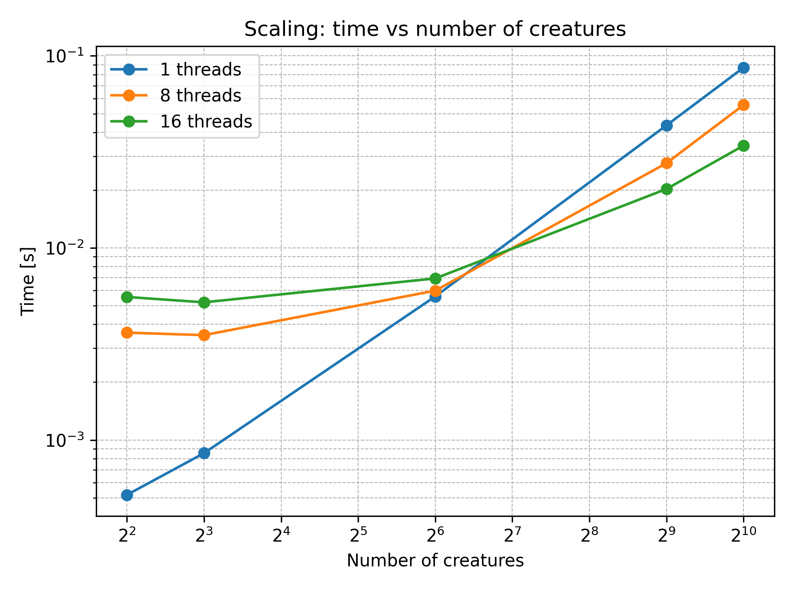
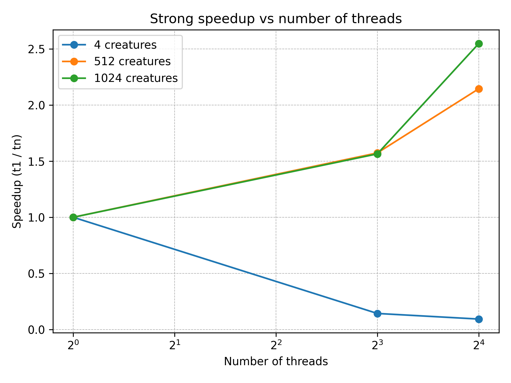

#  Stochastic Tunnelling Approach
Stochastic Tunnelling (ST) is an optimization algorithm designed for determining the global minima of complex and rugged energy landscapes. It is a generic physically motivated generalization of
simulated annealing. This approach circumvents the freezing problem which arises when the energy difference between “adjacent” local minima on the energy surface is much smaller than the energy of 
intervening transition states separating them.The physical idea behind the stochastic tunneling method is to allow the particle to “tunnel” forbidden regions, once it has been determined
that they are irrelevant for the low-energy properties of the problem. This can be accomplished by applying the transformation:

$$
f_{\text{STUN}}(x) = 1 - \exp[-\gamma(f(x) - f_0)],
$$

where $f_0$ is the lowest minimum encountered thus far. The effective potential preserves the locations of all minima, but maps the entire energy space from $f_0$ to the maximum
of the potential onto the interval [0, 1]. The degree of steepness of the cutoff of the high-energy regions is controlled by the tunneling parameter $\gamma$. To illustrate the physical content of the transformation we consider a Monte Carlo process at some fixed inverse
temperature $\beta$. A step from $x_1$ to $x_2$ with $\Delta = f(x_1) - f(x_2)$ ­  is accepted with probability $\tilde{w}_{1\to 2}=\exp(-\tilde{\beta}\Delta)$. In the process the temperature rises rapidly when the local energy is larger than $f_0$ and the particle diffuses (or tunnels) freely through potential barriers of arbitrary height. As better and better minima are found, ever larger
portions of the high-energy part of the function surface are flattened out. In analogy to the simulated annealing approach this behavior can be interpreted as a self-adjusting cooling schedule that is optimized as the simulation proceeds. Parameter $\beta$ is adjusted during the simulation. If a short-time moving average of the $f_{stun}$ exceeds the threshold $f_{\text{thresh}}$, $\beta$ is reduced by some fixed factor, otherwise it is increased. \beta is updated in the following manner: The average number of times a particle changes its position over the last N time steps is computed. If this average exceeds a predetermined threshold, the β parameter is increased by an adjustment factor. Conversely, if the average falls below the threshold, β is decreased. This adaptive mechanism ensures an appropriate balance between periods of search and periods of tunneling, optimizing the particle's exploration strategy.


## Multithreading version (OMP)
### Main
> ⚙️ **Executable Overview** – This section explains how to run the main OpenMP Stochastic Tunnelling implementation.


#### Execution
An example invocation of the `main` executable for the OpenMP Stochastic Tunnelling implementation (all the detailed flag for main execution are in the main readme page):

```bash
./build/main -a stochastic_omp -d 2 -n 10 -i 1000 -f sphere
```

#### Sample output
```console

Minimum found:
  f(3.185893e-04, -3.450245e-03) = 1.529150e-07
  Total execution time: 0.024336 seconds
```

### Test
> ✅ **Test Suite Summary** – Automated tests  to validate correctness and convergence.


A comprehensive test suite is provided to verify the correctness and convergence properties of the Stochastic Tunnelling implementation. All tests are written in C++17 using the GoogleTest framework and exercise the algorithm on four classic benchmark functions.

#### Function tested 
| Test Name                         | Objective Function | Convergence Criterion                |
| --------------------------------- | ------------------ | ------------------------------------ |
| `TunnellingConvergence.Sphere`            | Sphere             | ‖f(x) – 0‖ ≤ 1 × 10⁻3                |
| `TunnellingConvergence.Rosenbrock`        | Rosenbrock         | ‖f(x) – 0‖  ≤ 1 × 10⁻2 |
| `TunnellingConvergence.Rastrigin`         | Rastrigin          | ‖f(x) – 0‖ ≤ 1 × 10⁻1               |
| `TunnellingConvergence.EuclideanDistance`         | Euclidean Distance         | ‖f(x) – 0‖ ≤ 1 × 10⁻2               |


#### Test Setup

- **Framework:** GoogleTest  
- **Dimensions:** 2  
- **Population size:** 100 candidates  
- **Max iterations:** 1 000  
- **Random seed:** 42  
- **Search bounds:** \[-10, 10\]  
- **Threads:** 5
- **Starting value of sigma (sigma_max)** = 1.0
- **Final value of sigma (sigma_min)** = 5.e-5
- **Gamma** = 0.0001
- **Beta_adjust_factor** = 0.9
- **Number of step used to compute avg of movements (tunnelling)** = 10
- **Threshold (beta_tresholding)** = 0.2
- **Frequency of best-position exchange among particles (time_step_updating)** = 100
  

Each test invokes:
```cpp
	const std::pair<std::vector<double>, double> result = 
		algorithm::run_multi_stochastic_tunnelling(
    dimensions,
    max_iterations,
    seed,
    lower_bound,
    upper_bound,
    sigma_max,
    sigma_min,
    s,
    gamma,
    beta_adjust_factor,
    false /*verbose*/,
    beta,
    tunnelling,
    beta_tresholding,
    num_positions,
    time_step_updating,
    num_threads);
```
#### Test result 
All four tests passed:

```console
[==========] Running 4 tests from 1 test suite.
[----------] Global test environment set-up.
[----------] 4 tests from TunnellingConvergence
[ RUN      ] TunnellingConvergence.Sphere
[       OK ] TunnellingConvergence.Sphere (53 ms)
[ RUN      ] TunnellingConvergence.Rosenbrock
[       OK ] TunnellingConvergence.Rosenbrock (24 ms)
[ RUN      ] TunnellingConvergence.Rastrigin
[       OK ] TunnellingConvergence.Rastrigin (28 ms)
[ RUN      ] TunnellingConvergence.EuclideanDistance
[       OK ] TunnellingConvergence.EuclideanDistance (42 ms)
[----------] 4 tests from TunnellingConvergence (149 ms total)

[----------] Global test environment tear-down
[==========] 4 tests from 1 test suite ran. (149 ms total)
[  PASSED  ] 4 tests.
```


#### Summary of test duration
| Test                   | Duration |
| ---------------------- | -------: |
| Sphere                 |    53 ms |
| Rosenbrock             |    24 ms |
| Rastrigin              |    28 ms |
| Euclidean Distance     |    42 ms
| **Total elapsed time** |   280 ms |


### Benchmark
> 📊 **Performance Benchmarking** – Evaluate speedup and scaling on different workloads and thread counts.

The algorithm was tested with varying numbers of threads and different population sizes (called "creatures").

####  Time vs Number of Creatures



This plot shows how the execution time (in seconds, log scale) varies as the number of creatures increases, for 1, 8, and 16 threads:

- With **1 thread**, the time grows consistently with the number of creatures.
- With **8 and 16 threads**, the performance improves significantly when the number of creatures is sufficiently large.
- For **small numbers of creatures**, multithreading introduces overhead that can outweigh the benefits of parallelization.
- The curves flatten in the low-creature region for 8 and 16 threads, showing that overhead dominates until the workload becomes heavy enough.

####  Strong Speedup vs Number of Threads



This plot shows **strong scaling**, i.e., how speedup changes as the number of threads increases, for a fixed number of creatures (4, 512, and 1024):

- **4 creatures:** Speedup decreases with more threads due to overhead dominating such a small workload.
- **512 creatures:** Modest speedup is observed, showing that parallelism becomes more effective.
- **1024 creatures:** Best performance scaling, achieving a speedup > 2.5× with 16 threads.

####  Conclusions

- Parallel execution is effective only when the number of creatures is large enough to amortize thread management overhead.
- For small problem sizes, single-threaded execution remains more efficient.
- The algorithm demonstrates **scalability potential**, especially on larger workloads.


## Multiprocessing version (MPI)

> **Note:**
> Follow the instructions in the main readme page to compile properly to use MPI.
> This MPI-based implementation is provided for educational purposes. In practice, MPI shines on distributed systems or clusters, whereas on a single multi-core machine it can incur additional communication overhead. As a result, we do not include a full benchmark suite here (and the Google Benchmark integration currently causes conflicts). What remains is:
> 1. an MPI-enabled `main` that runs Differential Evolution across multiple processes, and  
> 2. the same convergence tests you’ve already seen (using GoogleTest).

The algorithm is partitioned so that each MPI rank evolves its own subset of the population. At each generation:
1. every rank runs one DE update on its local candidates,  
2. each rank computes its best local solution,  
3. an `MPI_Allreduce` (with `MPI_MINLOC`) finds the global-best fitness and the rank that holds it,  
4. that rank broadcasts its best candidate vector to all others,  
5. the next generation proceeds using that shared global best.  

This design minimizes inter-process communication (only one `Allreduce` and one `Bcast` per iteration), at the cost of never mixing candidates between ranks.

### Main  
You can run it like so (full detail flag usage in main readme page):
```bash
mpirun -n 4 ./build/main -a differential_mpi -d 2 -n 100 -i 100 -f sphere -j 1
```
Sample output (only a few iterations shown):
```console
Iteration n. 1 / 100
  Current minimum:
  f(-8.384779e+00, 2.789538e+00) = 7.808604e+01

Iteration n. 2 / 100
  Current minimum:
  f(-7.100683e+00, 5.125734e+00) = 7.669284e+01

…

Iteration n. 98 / 100
  Current minimum:
  f(-1.217977e-12, -9.401532e-13) = 2.367357e-24

Iteration n. 99 / 100
  Current minimum:
  f(-1.217977e-12, -9.401532e-13) = 2.367357e-24

Iteration n. 100 / 100
  Current minimum:
  f(2.020037e-13, -1.754170e-13) = 7.157664e-26

Minimum found:
  f(2.020037e-13, -1.754170e-13) = 7.157664e-26  
Total execution time: 0.001724 seconds
```
### Test
You can run the tests like so:
```bash
mpirun -n 4 test_de_convergence_mpi
```

All the test are passed even in the multiprocessing version of the algorithm:
```console
[==========] Running 4 tests from 1 test suite.
[----------] Global test environment set-up.
[----------] 4 tests from DeConvergenceMPI
[ RUN      ] DeConvergenceMPI.Sphere
[==========] Running 4 tests from 1 test suite.
[----------] Global test environment set-up.
[----------] 4 tests from DeConvergenceMPI
[ RUN      ] DeConvergenceMPI.Sphere
[==========] Running 4 tests from 1 test suite.
[----------] Global test environment set-up.
[----------] 4 tests from DeConvergenceMPI
[ RUN      ] DeConvergenceMPI.Sphere
[==========] Running 4 tests from 1 test suite.
[----------] Global test environment set-up.
[----------] 4 tests from DeConvergenceMPI
[ RUN      ] DeConvergenceMPI.Sphere
[       OK ] DeConvergenceMPI.Sphere (8 ms)
[ RUN      ] DeConvergenceMPI.EuclideanDistance
[       OK ] DeConvergenceMPI.Sphere (8 ms)
[ RUN      ] DeConvergenceMPI.EuclideanDistance
[       OK ] DeConvergenceMPI.Sphere (8 ms)
[ RUN      ] DeConvergenceMPI.EuclideanDistance
[       OK ] DeConvergenceMPI.Sphere (8 ms)
[ RUN      ] DeConvergenceMPI.EuclideanDistance
[       OK ] DeConvergenceMPI.EuclideanDistance (9 ms)
[ RUN      ] DeConvergenceMPI.Rosenbrock
[       OK ] DeConvergenceMPI.EuclideanDistance (9 ms)
[ RUN      ] DeConvergenceMPI.Rosenbrock
[       OK ] DeConvergenceMPI.EuclideanDistance (9 ms)
[ RUN      ] DeConvergenceMPI.Rosenbrock
[       OK ] DeConvergenceMPI.EuclideanDistance (9 ms)
[ RUN      ] DeConvergenceMPI.Rosenbrock
[       OK ] DeConvergenceMPI.Rosenbrock (5 ms)
[ RUN      ] DeConvergenceMPI.Rastrigin
[       OK ] DeConvergenceMPI.Rosenbrock (5 ms)
[ RUN      ] DeConvergenceMPI.Rastrigin
[       OK ] DeConvergenceMPI.Rosenbrock (5 ms)
[ RUN      ] DeConvergenceMPI.Rastrigin
[       OK ] DeConvergenceMPI.Rosenbrock (5 ms)
[ RUN      ] DeConvergenceMPI.Rastrigin
[       OK ] DeConvergenceMPI.Rastrigin (5 ms)
[----------] 4 tests from DeConvergenceMPI (28 ms total)

[----------] Global test environment tear-down
[==========] 4 tests from 1 test suite ran. (28 ms total)
[  PASSED  ] 4 tests.
[       OK ] DeConvergenceMPI.Rastrigin (5 ms)
[----------] 4 tests from DeConvergenceMPI (28 ms total)

[----------] Global test environment tear-down
[==========] 4 tests from 1 test suite ran. (28 ms total)
[  PASSED  ] 4 tests.
[       OK ] DeConvergenceMPI.Rastrigin (5 ms)
[----------] 4 tests from DeConvergenceMPI (28 ms total)

[----------] Global test environment tear-down
[==========] 4 tests from 1 test suite ran. (28 ms total)
[  PASSED  ] 4 tests.
[       OK ] DeConvergenceMPI.Rastrigin (5 ms)
[----------] 4 tests from DeConvergenceMPI (28 ms total)

[----------] Global test environment tear-down
[==========] 4 tests from 1 test suite ran. (28 ms total)
[  PASSED  ] 4 tests.

```

